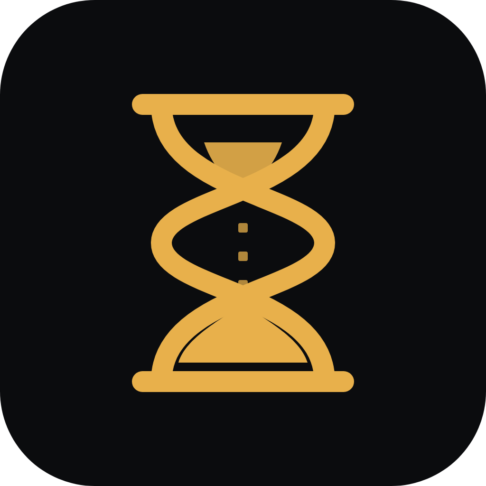
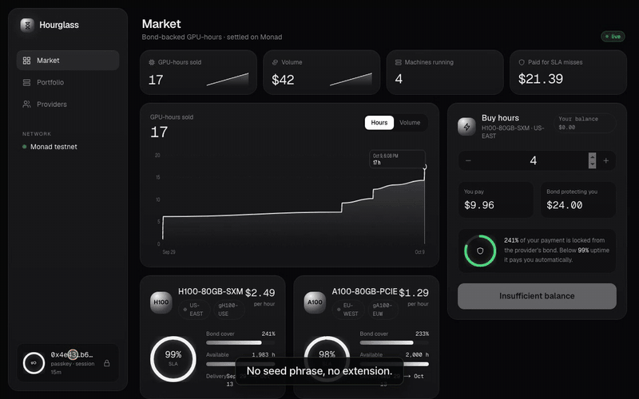
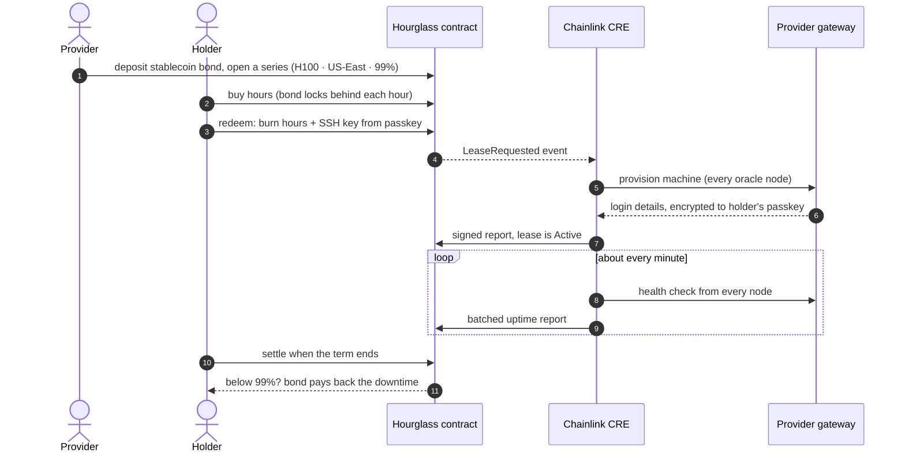
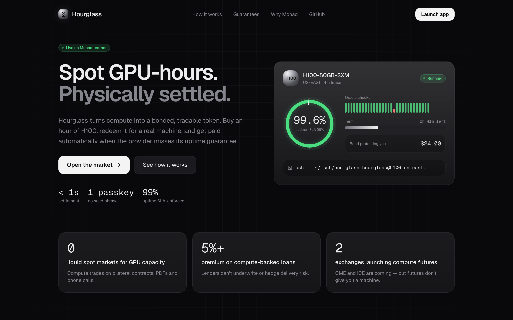
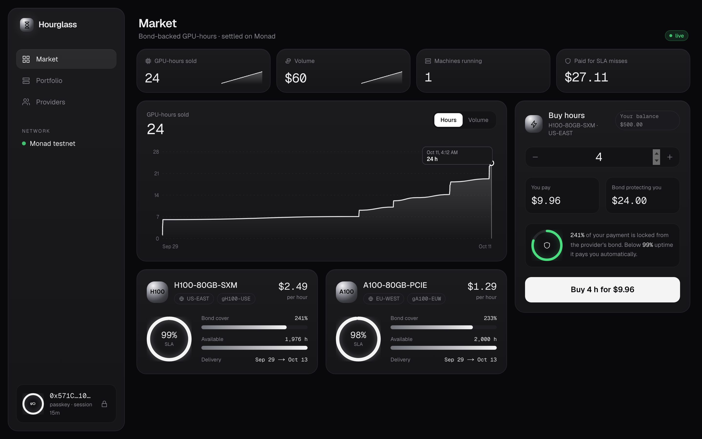
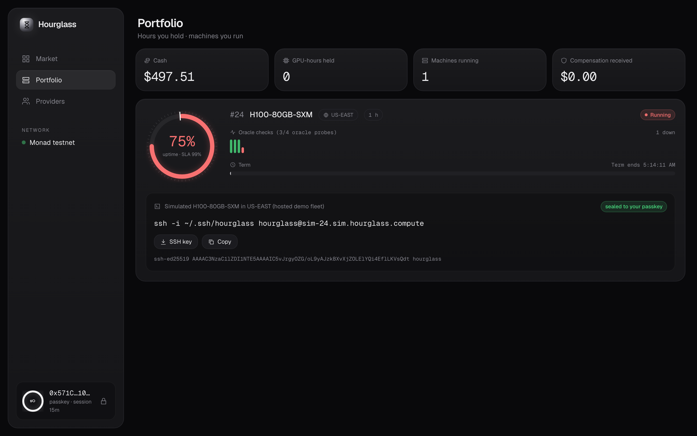
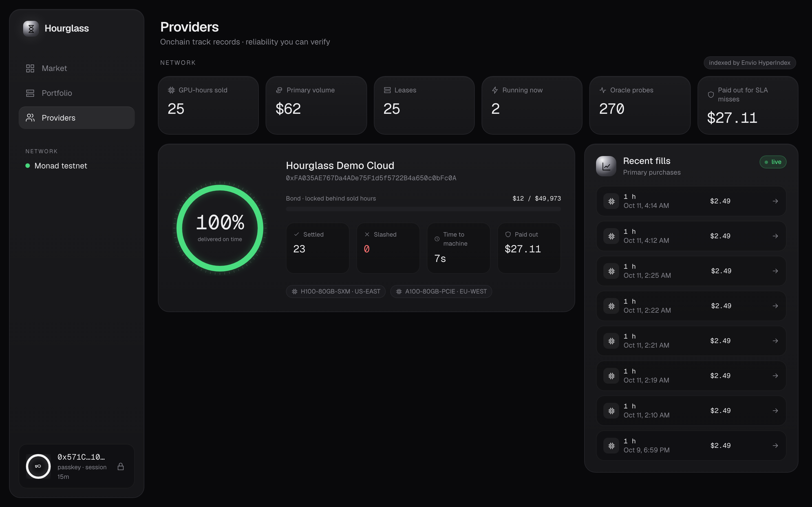
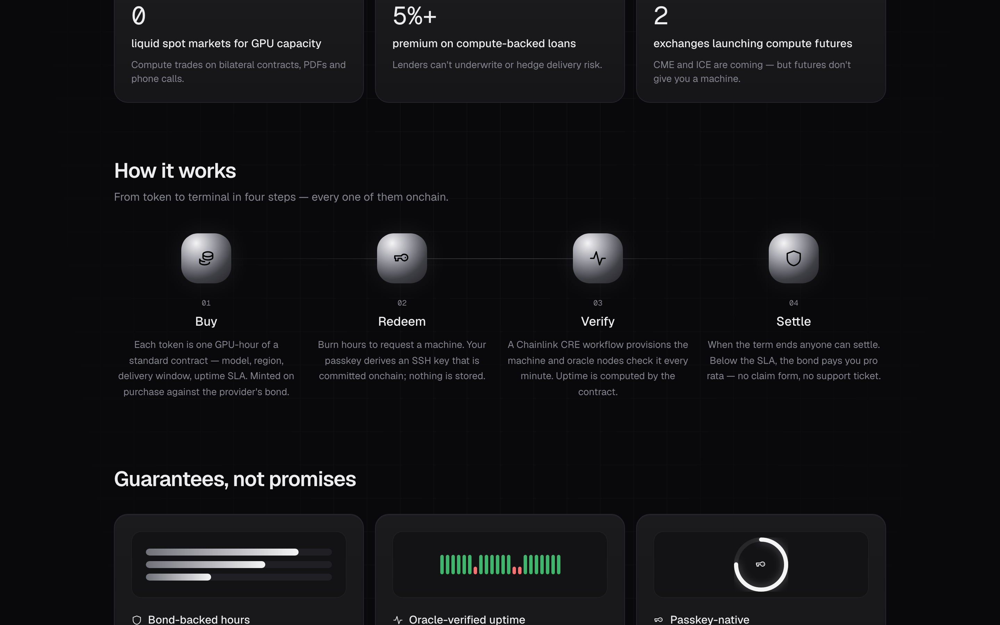
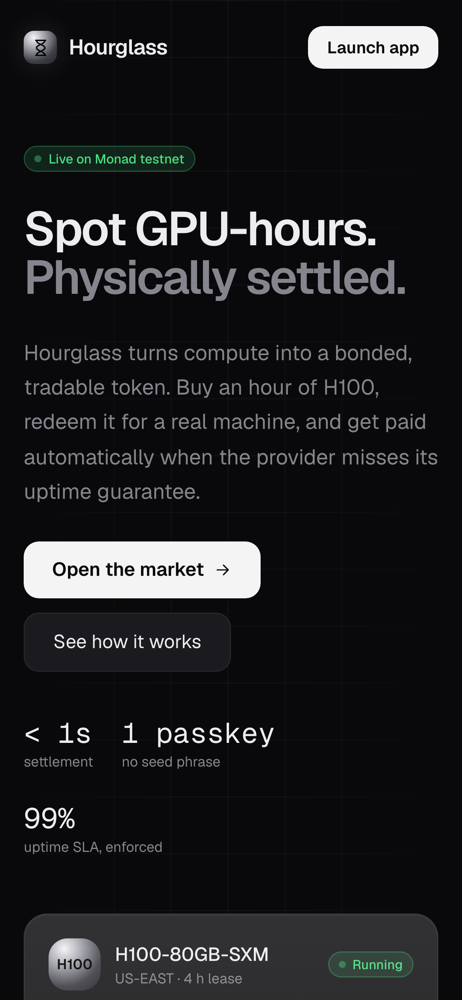
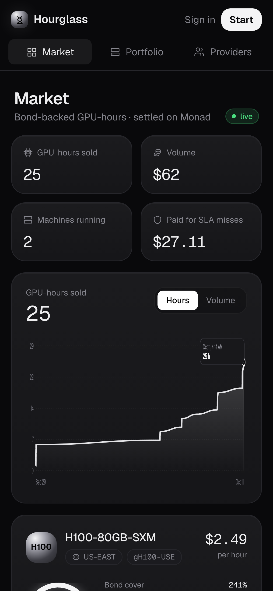

<div align="center">



# Hourglass

**Spot GPU-hours on Monad. Physically settled.**

Buy an hour of GPU time as a token, redeem it for a real machine, and get paid automatically if the provider misses its uptime promise.

[](https://testnet.monadscan.com/address/0xA8EA1800A9bd1EE278902E9F782BEfFbad0CF380)
[](cre/)
[](web/lib/mera.ts)
[](indexer/)
[](contracts/test)
[](e2e/tests)

[**Live app**](https://hourglass-compute.vercel.app) ·
[**Demo video**](submission/video/hourglass-walkthrough.mp4) ·
[**Testing**](TESTING.md) ·
[**Contracts**](contracts/src)



</div>

## Contents

- [Why this exists](#why-this-exists)
- [How it works](#how-it-works)
- [What you can do](#what-you-can-do)
- [Screenshots](#screenshots)
- [Built with](#built-with)
- [Live deployment](#live-deployment)
- [Run it locally](#run-it-locally)
- [Project structure](#project-structure)
- [Testing](#testing)
- [Videos](#videos)
- [About the hosted demo](#about-the-hosted-demo)

## Why this exists

GPUs are one of the most valuable things you can rent, but buying GPU time is still done through private deals, often for a year at a time. There's no public price and no way to hedge. Nothing guarantees the machine shows up, and if it goes down mid-run you file a support ticket.

Lenders charge 5% or more extra to finance GPUs because nobody can price the risk of a machine not being delivered. CME and ICE have announced compute futures, but those settle in cash. You still don't get a machine.

Hourglass sells GPU time in hourly tokens that you can trade, redeem for a real machine, and get paid back on if the provider falls short.

## How it works



1. A provider deposits stablecoins as a bond and opens a series, for example an H100 in US-East with a 99% uptime promise.
2. Each token is one hour of that series. Every hour sold locks part of the provider's bond.
3. To get a machine, the holder burns tokens. Their passkey creates an SSH key, and the public half goes onchain.
4. A Chainlink CRE workflow asks the provider to start the machine and posts the login details onchain, encrypted so only the holder's passkey can read them.
5. Oracle nodes check the machine about once a minute and record each result onchain. The contract computes uptime from those checks.
6. When the term ends, anyone can settle. Below the promise, the bond pays the holder for the downtime. If no machine shows up within 30 minutes, the holder can claim the full penalty.

## What you can do

- Sign up with one passkey. No wallet, seed phrase, or extension.
- Buy GPU-hours and see exactly how much of the provider's bond protects them.
- Redeem hours for a machine and unlock its SSH command with your passkey.
- Watch uptime build up check by check, with the promise marked on the gauge.
- Settle a lease or claim a missed-delivery payout yourself.
- Compare providers by delivery rate, bond at risk, time to machine, and payouts.
- Wipe your browser data or switch devices, and get the same account and SSH key back from the passkey.

## Screenshots

| Landing page | Market |
|---|---|
|  |  |

| A running machine | Providers |
|---|---|
|  |  |

<details>
<summary>How it works section and phone layout</summary>



<p>


</p>
</details>

## Built with

| Piece | What it does here | Where |
|---|---|---|
| **Monad** | Settles trades and redemptions in under a second. Cheap enough to sell compute by the hour and check uptime onchain every minute. | [`contracts/`](contracts) |
| **Chainlink CRE** | Two workflows. One provisions machines when a redemption happens. The other checks uptime and writes it onchain. | [`cre/`](cre), evidence in [`cre/evidence/`](cre/evidence) |
| **Mera** | One passkey becomes the Monad account. A second passkey salt gives the SSH key and the key login details are encrypted to. | [`web/lib/mera.ts`](web/lib/mera.ts), [`shared/src/namespaces.ts`](shared/src/namespaces.ts) |
| **Envio HyperIndex** | Indexes provider records, trades, and every uptime check. The app reads it over GraphQL. | [`indexer/`](indexer) |
| **Aurora Intents** | Pay with USDC from Base, Arbitrum, Ethereum or Polygon and buy hours on Monad in one signature. Built, needs mainnet and an API key to switch on. | [`web/lib/aurora.ts`](web/lib/aurora.ts), [`contracts/src/HourglassRouter.sol`](contracts/src/HourglassRouter.sol) |

The app is Next.js on Vercel, the contracts use Foundry, and the tests use Playwright.

## Live deployment

App: https://hourglass-compute.vercel.app (Monad testnet)

| Contract | Address |
|---|---|
| Hourglass | `0xA8EA1800A9bd1EE278902E9F782BEfFbad0CF380` |
| HourglassRouter | `0x8027ab94c9D2EfA566A7E4CEe805129F60016f24` |
| Test USD (6 decimals) | `0x2B9D9040894a0f34f3E1228dE9E0bF9fE05117A5` |
| gH100-USE (H100, US-East) | `0x9d591abC5f477a22A13Ebc269d78126C65A56b4F` |
| gA100-EUW (A100, EU-West) | `0x151dF710Ada39C8e081a24c0b9e6c28693f674dA` |

Envio GraphQL: `https://indexer.dev.hyperindex.xyz/aa369f5/v1/graphql`

To try it, open the app in Chrome or Safari with iCloud Keychain, Google Password Manager or 1Password, click **Get started**, and approve the passkey prompt. New accounts get testnet gas and 500 test dollars automatically.

## Run it locally

You need Node 22+, pnpm, and Foundry.

```bash
git clone https://github.com/codeswithroh/hourglass && cd hourglass
pnpm install
cd contracts && forge test && cd ..
```

Run everything on a local chain:

```bash
bash scripts/dev-stack.sh
```

Run the web app against the testnet deployment, the same way it runs on Vercel (needs `contracts/.env` with the demo keys):

```bash
bash scripts/hosted-local.sh
```

Run the real Chainlink workflows in the CRE simulator (needs `cre login`):

```bash
ORACLE=cre bash scripts/testnet-stack.sh
```

## Project structure

```text
contracts/   Hourglass, HourglassRouter, ComputeHourToken + Foundry tests and deploy scripts
cre/         Chainlink CRE workflows: provision (log trigger) and prober (cron)
web/         Next.js app: landing page, market, portfolio, providers, hosted gateway and oracle routes
gateway/     Standalone provider gateway with simulated, Docker and RunPod backends
indexer/     Envio HyperIndex config, schema and handlers
shared/      Passkey key derivation, SSH key format, encrypted access (sealed box)
e2e/         Playwright tests and the scripts that record the demo videos
scripts/     Local stacks, dev oracle, mainnet deploy
submission/  Logo, write-up and demo videos
```

## Testing

| What | Command |
|---|---|
| Contracts (23 tests, including fuzz) | `cd contracts && forge test` |
| Passkey crypto | `cd shared && pnpm test` |
| Full flow on a local chain | `node --experimental-transform-types scripts/e2e-local.ts` |
| Real SSH with the passkey key | `DRIVER=docker node --experimental-transform-types scripts/e2e-local.ts` |
| Browser test against the live site | `cd e2e && BASE_URL=https://hourglass-compute.vercel.app npx playwright test tests/lifecycle.spec.ts` |

The browser test signs up with a passkey, buys and redeems an hour, unlocks the machine, watches uptime checks, simulates an outage, and wipes all browser storage to check the same account comes back. More detail in [TESTING.md](TESTING.md).

## Videos

| Video | Length |
|---|---|
| [Product walkthrough](submission/video/hourglass-walkthrough.mp4) | 1:56 |
| [Chainlink CRE live simulation](submission/cre-video/hourglass-cre.mp4) | 1:13 |
| [Mera as the account layer](submission/mera-ux-video/hourglass-mera-ux.mp4) | 1:01 |
| [Mera keys beyond the wallet](submission/mera-prf-video/hourglass-mera-prf.mp4) | 1:10 |
| [Envio indexer](submission/envio-video/hourglass-envio.mp4) | 0:44 |

## About the hosted demo

The demo provider runs simulated GPUs, so the SSH address in the hosted app is a placeholder. A real SSH login with the passkey key is covered by the Docker test above.

On Vercel, a small server job does the same three things as the Chainlink workflows (start machines, check uptime, settle leases). It runs right after a redemption and while someone has the portfolio open. The Chainlink workflows themselves are in [`cre/`](cre) and have been run against the same contracts.

## Team

Built by [Rohit Purkait](https://github.com/codeswithroh) for the Monad Metropolis hackathon.
